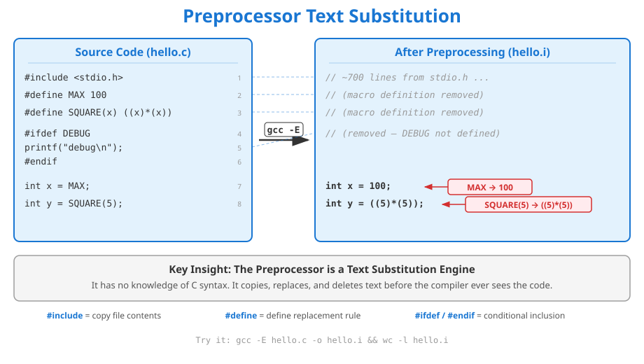
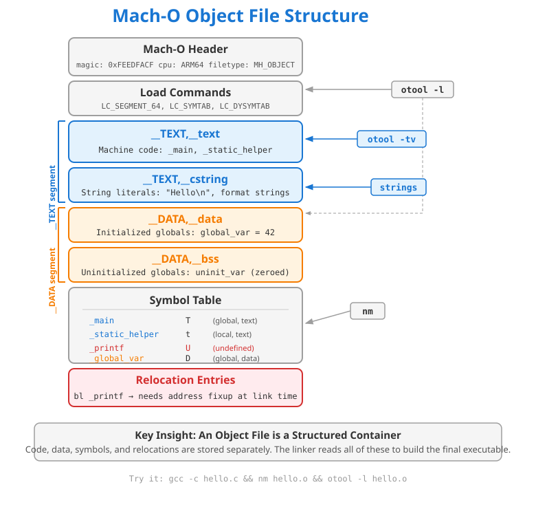

# Chapter 02: The Compilation Model

## Overview

Chapter 01 showed that `gcc hello.c -o hello` is not a single step -- it is a four-stage pipeline. This chapter goes deep into each stage. You will learn what the preprocessor actually does with `#define` and `#include` (text substitution, not compilation), how the compiler translates C into ARM64 assembly, what an object file contains (machine code, symbol tables, relocation entries), and how the linker combines multiple `.o` files into a final executable by resolving symbol references. By the end of this chapter, you will be able to read `nm` output, interpret Mach-O sections, and debug "undefined symbol" linker errors with confidence.

## Prerequisites

- **Chapter 01: Hello Machine** -- you should understand the four compilation stages at a high level, the ARM64 prologue/epilogue pattern, and the basic process memory layout.

## K&R Reference

- **Section 4.11:** The C Preprocessor (`#define`, `#include`, `#ifdef`, `#if`)
- **Section 4.5:** Header Files (separating declarations from definitions)
- **Section 4.6:** Static Variables (file-local scope, persistence)
- **Appendix A12:** Preprocessing (stringification, token pasting, predefined macros)
- **Key Quote:** "A definition announces the properties of a variable; a declaration, in addition, causes storage to be set aside." -- K&R, Section 1.7 (paraphrased for clarity)

---

## Layer 1: Concept -- The Four Stages in Depth

### Stage 1: The Preprocessor (gcc -E)

The preprocessor is a **text substitution engine**. It does not understand C syntax. It operates on lines of text before the compiler ever sees your code. There are five categories of preprocessor operations:

**Object-like macros** (`#define MAX_BUFFER 1024`) perform simple text replacement. Every occurrence of `MAX_BUFFER` in the source is replaced with the literal text `1024`. The macro name disappears entirely -- it has no entry in the symbol table, occupies no memory, and generates no machine instructions. See `examples/preprocessor_stages.c` lines 34-36 for demonstrations.

**Function-like macros** (`#define SQUARE(x) ((x)*(x))`) expand inline at every call site. Unlike function calls, they generate no `bl` instruction and no stack frame. The expansion is pure text substitution: `SQUARE(3+1)` becomes `((3+1)*(3+1))` = 16, which is correct because of the parentheses. Without parentheses, `SQUARE(3+1)` would become `3+1*3+1` = 7 (wrong). See `examples/preprocessor_stages.c` lines 55-62.

**Stringification (`#`) and token pasting (`##`)** are metaprogramming tools. `#x` turns a macro argument into a string literal: `STRINGIFY(hello)` becomes `"hello"`. `a##b` concatenates tokens: `CONCAT(my_, var)` becomes `my_var`. These are resolved entirely at preprocessing time. See `examples/preprocessor_stages.c` lines 78-80.

**Conditional compilation** (`#ifdef`, `#ifndef`, `#if`, `#elif`, `#else`, `#endif`) includes or excludes entire blocks of code before the compiler sees them. Excluded code generates zero assembly, zero machine code, and zero binary footprint. This is how debug-only code and platform-specific code paths are implemented. See `examples/preprocessor_stages.c` lines 95-103.

**File inclusion** (`#include <stdio.h>`) copies the entire contents of the named file into the source at that point. On macOS, `#include <stdio.h>` pastes roughly 700-900 lines of declarations. These are declarations only (function prototypes, type definitions) -- no machine code is generated from them.

Verify this yourself:

```bash
gcc -E examples/preprocessor_stages.c | wc -l    # ~800+ lines after expansion
gcc -E examples/preprocessor_stages.c > /tmp/pp.i  # inspect the full output
```

### Stage 2: The Compiler (gcc -S)

The compiler reads the preprocessed source (pure C with no `#` directives) and produces assembly language. This stage performs:

1. **Lexing and parsing** -- tokenizing the source and building an abstract syntax tree (AST)
2. **Type checking** -- verifying that function arguments match declarations, that types are compatible
3. **Optimization** -- at `-O0`, essentially none; at `-O2`, constant folding, dead code elimination, inlining
4. **Code generation** -- translating the AST into ARM64 assembly instructions

The output is a `.s` file containing human-readable assembly with directives like `.section`, `.globl`, and `.p2align`.

### Stage 3: The Assembler (gcc -c)

The assembler reads the `.s` file and encodes each mnemonic into its binary machine code representation. It produces a **Mach-O object file** (`.o`). This file contains:

- **Machine code** in the `__TEXT,__text` section
- **String literals** in the `__TEXT,__cstring` section
- **Initialized data** in the `__DATA,__data` section
- **A symbol table** mapping names to types and section offsets
- **Relocation entries** marking places where the linker must patch addresses

The object file is not yet executable. References to external functions (like `printf`) are recorded as undefined symbols (`U` in `nm`). The actual addresses are placeholders waiting for the linker.

### Stage 4: The Linker (gcc without -c or -S)

The linker performs two critical jobs:

**Symbol resolution:** For every undefined symbol (`U`) in each `.o` file, the linker searches other `.o` files and libraries to find the definition. If `linking_main.o` has `U _add`, the linker finds `T _add` in `linking_helper.o` and records the match. If a symbol cannot be found, you get "undefined symbols" -- the most common linker error.

**Relocation patching:** Once all symbols are resolved, the linker patches every reference with the final address. The `bl _add` instruction in `linking_main.o` originally has a placeholder offset; the linker overwrites it with the actual offset to `_add` in the merged binary. The `__TEXT,__text` sections from all `.o` files are concatenated into one contiguous segment.

See `examples/linking_main.c` and `examples/linking_helper.c` for a complete multi-file linking demonstration.

### Static vs Dynamic Linking

**Static linking** copies library code into your executable. The resulting binary is self-contained but larger.

**Dynamic linking** records a reference to a shared library (`.dylib` on macOS). On macOS, virtually all C programs link dynamically against `libSystem.dylib`, which contains the C standard library, POSIX functions, and system call wrappers. The dynamic linker (`dyld`) resolves these references at load time, mapping the shared library into your process address space.

You can see this with `otool -L`:

```bash
otool -L examples/linking_demo
# Output shows: /usr/lib/libSystem.B.dylib (compatibility version ...)
```

---

## Layer 2: Assembly -- Compilation Artifacts

### Address Loading: adrp/add with @PAGE/@PAGEOFF

ARM64 immediates are limited to 21 bits, which cannot represent a full 64-bit address. The compiler uses a two-instruction pattern to load addresses:

```asm
adrp  x0, l_.str@PAGE        ; load 4KB-aligned page address (PC-relative)
add   x0, x0, l_.str@PAGEOFF ; add offset within the page
```

This pattern appears in `object_file_anatomy.c` and `preprocessor_stages.c` whenever the code references a string literal or global variable defined in the same translation unit. The assembler generates relocation entries for both instructions, and the linker patches them with final addresses.

### Extern Variables: GOT-Indirect Addressing

When accessing a variable declared `extern` (defined in another translation unit), the compiler cannot assume the variable is on the same page. Instead, it uses the **Global Offset Table (GOT)**, an extra level of indirection:

```asm
adrp  x8, _shared_counter@GOTPAGE       ; load page of GOT entry
ldr   x8, [x8, _shared_counter@GOTPAGEOFF] ; load address FROM the GOT
ldr   w9, [x8]                           ; dereference to get the value
```

This three-instruction sequence (vs. two for local symbols) is the cost of separate compilation. The GOT entry is filled in by the linker with `shared_counter`'s actual address. See `examples/linking_main.c` lines 75-80 for the annotated assembly.

### Function Calls: bl and Relocation

A cross-file function call generates a `bl` (branch with link) instruction:

```asm
bl    _add        ; call add() -- offset is a placeholder in the .o file
```

In the object file, the `bl` target is zero -- a relocation entry tells the linker "patch this instruction with `_add`'s address." After linking, the `bl` encodes the real offset to `_add`'s code in the merged `__TEXT,__text` segment.

### nm Output Walkthrough

The `nm` tool reads the symbol table from an object file or executable. Each line shows an address (or blank), a type letter, and a symbol name:

```
$ nm object_file_anatomy.o
                 S _banner                  ; global, const pointer (__DATA,__const)
                 D _global_initialized      ; global, initialized data (__DATA,__data)
                 C _global_uninitialized    ; common (tentative definition)
                 T _main                    ; global, text (code)
                 d _main.static_var         ; local, initialized data
                 U _printf                  ; undefined (external reference)
                 t _static_helper           ; local, text (code)
```

| Letter | Meaning | Visibility |
|--------|---------|------------|
| `T` | Code in `__TEXT,__text` | Global (visible to linker) |
| `t` | Code in `__TEXT,__text` | Local (file-private, `static`) |
| `D` | Initialized data in `__DATA,__data` | Global |
| `d` | Initialized data in `__DATA,__data` | Local (`static` variable) |
| `S` | Symbol in other section (e.g., `__DATA,__const`) | Global |
| `C` | Common symbol (uninitialized global, tentative definition) | Global |
| `U` | Undefined (resolved by linker) | External reference |

**Before linking** (`linking_main.o`): `_add`, `_shared_counter`, `_increment_counter` are all `U`.
**After linking** (`linking_demo`): those `U` entries are resolved. Only symbols from `libSystem.dylib` remain undefined (resolved by `dyld` at runtime).

---

## Layer 3: Memory -- Object File to Process Image

### Mach-O File Structure

Every `.o` file and executable on macOS uses the **Mach-O** (Mach Object) format. The structure has three parts:

1. **Header** -- identifies the file: magic number (`0xFEEDFACF` for 64-bit), CPU type (ARM64), file type (`MH_OBJECT` for `.o`, `MH_EXECUTE` for executables)
2. **Load commands** -- describe the segments and sections, the symbol table location, dynamic linking info (`LC_SEGMENT_64`, `LC_SYMTAB`, `LC_DYSYMTAB`)
3. **Raw data** -- the actual bytes: machine code, string literals, initialized data, symbol entries, relocation entries

### Sections in Detail

| Section | Segment | Contents | Read/Write | Tool |
|---------|---------|----------|------------|------|
| `__text` | `__TEXT` | Machine code (compiled functions) | Read + Execute | `otool -tv` |
| `__cstring` | `__TEXT` | String literals (`"Hello\n"`, format strings) | Read-only | `strings` |
| `__data` | `__DATA` | Initialized globals (`global_initialized = 42`) | Read + Write | `nm` (type D) |
| `__const` | `__DATA` | Const pointers, const data | Read-only | `nm` (type S) |
| `__bss` / `__common` | `__DATA` | Uninitialized globals (zero-filled at load) | Read + Write | `nm` (type C) |

### How Multiple .o Files Merge

When the linker combines `linking_main.o` and `linking_helper.o`:

1. Each `.o` file's `__TEXT,__text` section is concatenated into one `__TEXT` segment. `main()` code comes first, then `add()`, `increment_counter()`, and `square_internal()`.
2. Each `.o` file's `__TEXT,__cstring` sections are merged. All string literals from both files end up in one `__cstring` section.
3. Each `.o` file's `__DATA,__data` sections are merged. `global_initialized` and `shared_counter` share the same `__DATA` segment.
4. The symbol table is unified. Undefined references (`U`) are matched to definitions (`T`, `D`).
5. Relocation entries are processed: every `bl _add` and `adrp ... @GOTPAGE` is patched with the final address.

### Inspection Tools

```bash
nm object_file_anatomy.o              # symbol table (names + types)
otool -l object_file_anatomy.o        # load commands and section listing
otool -tv object_file_anatomy.o       # disassemble __TEXT,__text
strings object_file_anatomy.o         # all embedded string literals
size object_file_anatomy.o            # segment sizes (__TEXT, __DATA, __OBJC)
otool -L examples/linking_demo        # dynamic library dependencies
```

---

## Layer 4: Diagrams

### Diagram 1: Preprocessor Text Substitution



This diagram shows the preprocessor transforming source code (left) into preprocessed output (right). `#include <stdio.h>` expands to ~700 lines of declarations. `#define MAX 100` and `#define SQUARE(x) ((x)*(x))` are consumed as replacement rules and then erased. `#ifdef DEBUG ... #endif` is removed entirely because `DEBUG` is not defined. The remaining lines have their macros expanded: `int x = MAX;` becomes `int x = 100;` and `int y = SQUARE(5);` becomes `int y = ((5)*(5));`. The key insight: the preprocessor has no knowledge of C syntax -- it copies, replaces, and deletes text.

### Diagram 2: Mach-O Object File Structure



This diagram shows the internal structure of a Mach-O object file. From top to bottom: the Mach-O header (magic number, CPU type), load commands (`LC_SEGMENT_64`, `LC_SYMTAB`), the `__TEXT` segment (containing `__text` for machine code and `__cstring` for string literals), the `__DATA` segment (containing `__data` for initialized globals and `__bss` for zero-filled globals), the symbol table (mapping names like `_main` to types like `T`), and relocation entries (marking addresses that need patching). Tool annotations on the right show which tool inspects which part: `otool -l` for load commands and sections, `otool -tv` for disassembly, `strings` for string literals, and `nm` for the symbol table.

---

## Layer 5: Pitfalls

### Pitfall 1: Macro Operator Precedence

```c
#define SQUARE(x) x*x          // WRONG
int result = SQUARE(1 + 2);    // Expands to: 1 + 2*1 + 2 = 5 (not 9)
```

The fix is to parenthesize both the arguments and the entire expression:

```c
#define SQUARE(x) ((x) * (x))  // CORRECT
int result = SQUARE(1 + 2);    // Expands to: ((1 + 2) * (1 + 2)) = 9
```

This is demonstrated in `examples/preprocessor_stages.c` lines 55-56. The compiler sees only the expanded form -- there is no "macro call" at runtime. Every function-like macro must parenthesize every parameter use and the whole body.

### Pitfall 2: Macro Side Effects

```c
#define SQUARE(x) ((x) * (x))
int i = 3;
int result = SQUARE(i++);  // Expands to: ((i++) * (i++))
```

This increments `i` twice in a single expression. The order of evaluation between the two `i++` sub-expressions is unsequenced in C11, making this **undefined behavior**. The value of `result` could be 9, 12, or anything else. Real functions do not have this problem because arguments are evaluated exactly once before the call.

### Pitfall 3: Missing Include Guards

```c
// helper.h -- NO include guard
int add(int a, int b);
```

If `helper.h` is included by two `.c` files that are linked together, the linker sees two declarations -- that is fine. But if `helper.h` contains a variable *definition* (e.g., `int counter = 0;`), each `.c` file gets its own copy, and the linker reports a duplicate symbol error. Always use include guards:

```c
#ifndef HELPER_H
#define HELPER_H
int add(int a, int b);
extern int counter;  // declaration, not definition
#endif
```

See `examples/linking_helper.h` for the correct pattern.

### Pitfall 4: One Definition Rule (ODR) Violations

Defining a non-inline, non-static function in a header file included by multiple `.c` files violates the One Definition Rule. Each translation unit gets its own copy of the function, and the linker sees duplicate `T` symbols:

```
ld: error: duplicate symbol '_helper_func' in linking_main.o and linking_other.o
```

Fix: put only declarations (prototypes) in headers. Put definitions (implementations) in exactly one `.c` file. Use `static` or `inline` if you must define a function in a header.

### Pitfall 5: Missing Object Files at Link Time

```bash
gcc -c linking_main.c -o linking_main.o
gcc linking_main.o -o linking_demo    # FORGOT linking_helper.o
# ld: Undefined symbols: _add, _shared_counter, _increment_counter
```

The linker cannot resolve symbols that are not provided. Every `.o` file that defines referenced symbols must be listed on the link command line. The Makefile in this chapter handles this correctly -- see the `LINKING_SRCS` variable in `Makefile`.

### Pitfall 6: Static vs Extern Confusion

A `static` function is invisible to the linker. If you declare a function `static` in `linking_helper.c`, other files cannot call it -- even if you put a prototype in the header. Conversely, omitting `extern` on a variable declaration in a header turns it into a tentative definition, risking duplicate symbols.

```c
// linking_helper.c
static int square_internal(int a) { return a * a; }  // t in nm -- local

// linking_main.c
int result = square_internal(5);  // ERROR: undefined symbol
```

The `static` keyword in `linking_helper.c` (`examples/linking_helper.c` line 68) makes `square_internal` invisible outside that file. Only `add()` and `increment_counter()` (without `static`) are exported as `T` symbols.

---

## Examples

### `examples/preprocessor_stages.c` -- The Preprocessor in Five Stages

Demonstrates all five categories of preprocessor operations: object-like macros, function-like macros, stringification/token pasting, conditional compilation, and predefined macros. Each stage is annotated with `// ASSEMBLY:` and `// MEMORY:` comments explaining what the preprocessor removes and what the compiler actually sees.

Run the preprocessor to see the expansion:

```bash
gcc -E examples/preprocessor_stages.c | wc -l
gcc -E examples/preprocessor_stages.c | tail -50   # see the transformed code
```

### `examples/object_file_anatomy.c` -- Inside a Mach-O Object File

Creates one of every symbol type: global initialized data (`D`), uninitialized global (`C`), const pointer (`S`), static function (`t`), static local variable (`d`), and external reference (`U`). Prints runtime addresses and sizes for each symbol. The file header contains the exact `nm` output you should expect.

Inspect the object file:

```bash
gcc -c -O0 -g examples/object_file_anatomy.c -o /tmp/ofa.o
nm /tmp/ofa.o                        # symbol table
otool -l /tmp/ofa.o | grep -A5 sectname  # section listing
strings /tmp/ofa.o                   # embedded strings
```

### `examples/linking_main.c` + `examples/linking_helper.c` + `examples/linking_helper.h` -- Multi-File Linking

A two-file program demonstrating separate compilation and linker symbol resolution. `linking_main.c` calls `add()` and reads `shared_counter` -- both defined in `linking_helper.c`. Before linking, `nm linking_main.o` shows `_add` and `_shared_counter` as `U` (undefined). After linking, they are resolved. The assembly annotations show GOT-indirect addressing (`@GOTPAGE/@GOTPAGEOFF`) for extern variables vs. direct page addressing (`@PAGE/@PAGEOFF`) for local symbols.

Build step by step:

```bash
gcc -c examples/linking_main.c -o /tmp/lm.o
gcc -c examples/linking_helper.c -o /tmp/lh.o
nm /tmp/lm.o | grep ' U '           # undefined: _add, _shared_counter, _printf
nm /tmp/lh.o | grep ' T '           # defined: _add, _increment_counter
gcc /tmp/lm.o /tmp/lh.o -o /tmp/linking_demo
nm /tmp/linking_demo | grep -E '_add|_shared'  # resolved
```

---

## Exercises

| # | Title | Difficulty | Source |
|---|-------|-----------|--------|
| 1 | [Preprocessor Detective](exercises/exercise_01/) | :star: | Original (K&R 4.11 concepts) |
| 2 | [Object File Explorer](exercises/exercise_02/) | :star::star: | Original (requires nm analysis) |
| 3 | [Separate Compilation](exercises/exercise_03/) | :star::star::star: | Original (K&R 4.5, 4.6 concepts) |

**Exercise 01** tests your ability to predict preprocessor output. Given a file with object-like macros, function-like macros, token pasting, stringification, and conditional compilation, you fill in `printf` statements showing each macro's expanded value. Use `gcc -E` to verify your predictions.

**Exercise 02** requires you to predict `nm` symbol types. Given declarations of various kinds (global function, static function, initialized global, uninitialized global, extern reference), you identify the symbol type letter (`T`, `t`, `D`, `d`, `C`, `U`) for each. This exercise connects directly to the Layer 2 and Layer 3 content.

**Exercise 03** is the capstone: you take a monolithic single-file program and split it into three files (`solution.c`, `solution_helper.h`, `solution_helper.c`) using proper header guards, `extern` declarations, and separate compilation. This exercises every concept in the chapter: preprocessor (`#include`, include guards), compiler (type checking against declarations), and linker (symbol resolution across translation units).

---

## Going Beyond K&R

K&R 2nd Edition (1988) could not cover the following topics that are now essential to the modern C compilation model:

**Sanitizers in the build pipeline.** AddressSanitizer (`-fsanitize=address`) and UBSan (`-fsanitize=undefined`) are compiler passes that instrument your code during compilation. They insert runtime checks for buffer overflows, use-after-free, signed integer overflow, and other undefined behaviors. These work at the compilation stage -- the compiler inserts additional instructions around every memory access. Every example in this curriculum is compiled with sanitizers enabled.

**Link-Time Optimization (LTO).** With `-flto`, the compiler emits LLVM bitcode instead of machine code into the `.o` file. The linker then runs optimization passes across all translation units simultaneously, enabling inlining across file boundaries and dead code elimination that is impossible with traditional separate compilation. Try it:

```bash
gcc -flto -O2 examples/linking_main.c examples/linking_helper.c -o /tmp/lto_demo
```

**Profile-Guided Optimization (PGO).** Compile with `-fprofile-generate`, run the program on representative input, then recompile with `-fprofile-use`. The compiler uses the recorded branch frequencies to optimize hot paths and de-optimize cold paths. This is a two-pass compilation model that K&R never envisioned.

**Modern preprocessor features.** C11 added `_Generic` (type-generic selection), `_Static_assert` (compile-time assertion), and `_Noreturn` (function attribute). C23 adds `#embed` for binary file inclusion and `#elifdef`/`#elifndef` shorthand. The preprocessor, once a simple text engine, has grown more capable with each standard revision.

**Mach-O vs ELF.** K&R assumed a Unix `a.out` or early ELF environment. macOS uses Mach-O, which has different section naming (`__TEXT,__text` vs `.text`), different tools (`otool`/`nm` vs `readelf`/`objdump`), and a different dynamic linker (`dyld` vs `ld-linux.so`). The concepts are identical, but the tooling differs.

---

## Summary

After this chapter, you should understand:

1. **The preprocessor is a text substitution engine.** It runs before the compiler, replaces macros with their expansions, pastes file contents at `#include` sites, and conditionally includes or excludes code blocks. Macros occupy zero memory -- they are erased before compilation begins.

2. **An object file is a structured container.** It holds machine code (`__TEXT,__text`), string literals (`__TEXT,__cstring`), initialized data (`__DATA,__data`), a symbol table (inspectable with `nm`), and relocation entries (addresses the linker must patch).

3. **The linker resolves symbols and patches addresses.** Every `U` (undefined) symbol in a `.o` file must be matched to a `T` or `D` definition in another `.o` file or library. The linker concatenates sections from all `.o` files and overwrites placeholder addresses with final values.

4. **Extern variables use GOT-indirect addressing.** When the compiler encounters a variable declared `extern`, it generates `@GOTPAGE/@GOTPAGEOFF` instructions (three-instruction load) instead of direct `@PAGE/@PAGEOFF` (two-instruction load). This extra indirection is the cost of separate compilation.

5. **Macro pitfalls are text-substitution pitfalls.** Operator precedence errors (`SQUARE(1+2)` = 5), double evaluation (`SQUARE(i++)`), missing include guards, and ODR violations are all consequences of the preprocessor being a text engine, not a compiler.

Build and run everything:

```bash
cd chapters/02-compilation-model
make              # compile all examples with ASan + UBSan
make asm          # generate assembly output for all source files
make test         # run all exercise test harnesses
```

## What's Next

**Chapter 03: Process Memory Model** -- now that you understand how source code becomes a binary, we examine what happens when the OS loads that binary into memory. You will learn about virtual address spaces, the six memory segments (text, rodata, data, BSS, heap, stack), how `malloc` requests memory from the kernel, and how the stack grows and shrinks as functions are called and return.
